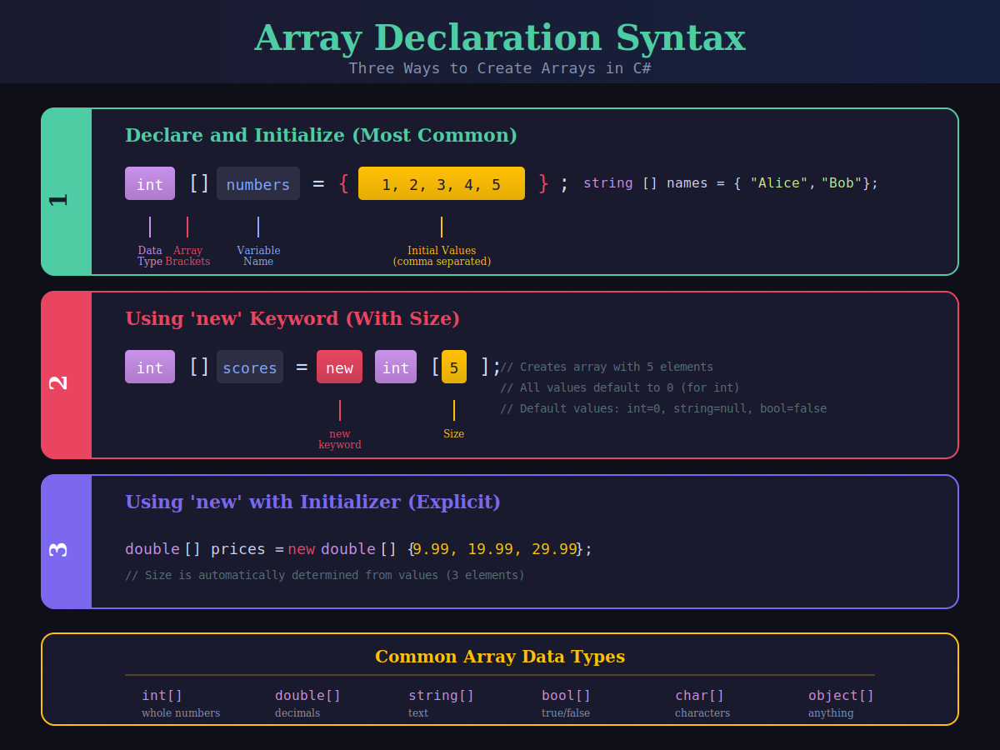
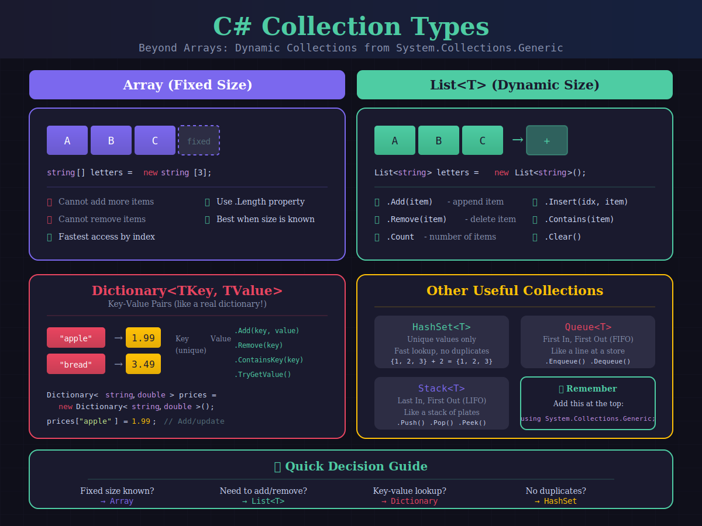

# 📚 C# Arrays, Collections & Exception Handling
## Guided Notes - Follow along in Visual Studio or VS Code!

---

## Part 1: Arrays

### 🖼️ Arrays Overview


### 🖼️ Array Syntax



---

## ▶ Demo 1: Creating Arrays

### 💡 What is an Array?
An array is a collection of items of the **same type** stored in **contiguous memory**. Arrays have a **fixed size** - once created, you cannot add or remove elements.

```csharp
// ============================================
// DEMO 1: Three Ways to Create Arrays
// ============================================

// Method 1: Declare and initialize with values (most common)
int[] scores = { 95, 87, 92, 78, 88 };

// Method 2: Using 'new' with a specific size (values default to 0)
int[] temperatures = new int[7];  // Array of 7 zeros

// Method 3: Using 'new' with initializer list
string[] weekdays = new string[] { "Mon", "Tue", "Wed", "Thu", "Fri" };

// Print array info
Console.WriteLine($"Scores array length: {scores.Length}");
Console.WriteLine($"First score: {scores[0]}");
Console.WriteLine($"Last score: {scores[scores.Length - 1]}");
```

**Output:**
```
Scores array length: 5
First score: 95
Last score: 88
```

### 📝 Your Notes:
_Write key observations here..._

---

> ⚠️ **Common Mistake: Index Out of Bounds**
> 
> Arrays are **zero-indexed**! An array of 5 elements has indexes 0, 1, 2, 3, 4 (NOT 1-5).
> `scores[5]` would crash because valid indexes are only 0-4!

---

## ▶ Demo 2: Working with Arrays

```csharp
// ============================================
// DEMO 2: Accessing and Modifying Array Elements
// ============================================

string[] students = { "Alice", "Bob", "Charlie", "Diana" };

// Reading elements by index
Console.WriteLine($"First student: {students[0]}");
Console.WriteLine($"Third student: {students[2]}");

// Modifying an element
students[1] = "Bobby";  // Change "Bob" to "Bobby"
Console.WriteLine($"Updated second student: {students[1]}");

// Looping through all elements with foreach
Console.WriteLine("\nAll students:");
foreach (string student in students)
{
    Console.WriteLine($"  - {student}");
}

// Looping with for loop (when you need the index)
Console.WriteLine("\nWith index numbers:");
for (int i = 0; i < students.Length; i++)
{
    Console.WriteLine($"  [{i}] {students[i]}");
}
```

**Output:**
```
First student: Alice
Third student: Charlie
Updated second student: Bobby

All students:
  - Alice
  - Bobby
  - Charlie
  - Diana

With index numbers:
  [0] Alice
  [1] Bobby
  [2] Charlie
  [3] Diana
```

### Key Points:

| Loop Type | When to Use |
|-----------|-------------|
| **foreach** | When you just need to read each value. Simpler syntax! |
| **for** | When you need the index position or want to modify elements. |

---

## Part 2: Collection Types

### 🖼️ Collection Types Comparison



---

## ▶ Demo 3: List\<T\> - Dynamic Arrays

### 💡 Why List instead of Array?
Lists can **grow and shrink** dynamically. You can add and remove items whenever you want! Use `using System.Collections.Generic;` at the top of your file.

```csharp
// ============================================
// DEMO 3: Lists - Add, Remove, and More!
// ============================================
using System.Collections.Generic;

// Create an empty list
List<string> shoppingList = new List<string>();

// Add items
shoppingList.Add("Milk");
shoppingList.Add("Bread");
shoppingList.Add("Eggs");
shoppingList.Add("Butter");

Console.WriteLine($"Items in list: {shoppingList.Count}");

// Remove an item
shoppingList.Remove("Bread");
Console.WriteLine($"After removing Bread: {shoppingList.Count}");

// Check if item exists
if (shoppingList.Contains("Milk"))
{
    Console.WriteLine("Don't forget the milk!");
}

// Insert at specific position
shoppingList.Insert(0, "Coffee");  // Insert at beginning

// Print all items
Console.WriteLine("\nShopping List:");
foreach (string item in shoppingList)
{
    Console.WriteLine($"  □ {item}");
}
```

**Output:**
```
Items in list: 4
After removing Bread: 3
Don't forget the milk!

Shopping List:
  □ Coffee
  □ Milk
  □ Eggs
  □ Butter
```

### List Methods Reference:

| Method | What It Does | Example |
|--------|--------------|---------|
| `.Add(item)` | Adds item to end | `list.Add("Apple")` |
| `.Remove(item)` | Removes first occurrence | `list.Remove("Apple")` |
| `.Insert(index, item)` | Inserts at position | `list.Insert(0, "First")` |
| `.Contains(item)` | Returns true/false | `list.Contains("Apple")` |
| `.Count` | Number of items | `list.Count` |
| `.Clear()` | Removes all items | `list.Clear()` |

---

## ▶ Demo 4: Dictionary\<TKey, TValue\>

### 🔑 Key-Value Pairs
A Dictionary stores pairs of related data. Each **key** maps to a **value**. Keys must be unique! Think of it like a real dictionary: the word (key) maps to its definition (value).

```csharp
// ============================================
// DEMO 4: Dictionary - Key/Value Storage
// ============================================

// Store student grades: Name -> Grade
Dictionary<string, int> grades = new Dictionary<string, int>();

// Add entries using indexer syntax
grades["Alice"] = 95;
grades["Bob"] = 87;
grades["Charlie"] = 92;

// Or use Add method
grades.Add("Diana", 88);

// Look up a value by key
Console.WriteLine($"Alice's grade: {grades["Alice"]}");

// Update a value
grades["Bob"] = 90;  // Bob studied more!

// Safe lookup with TryGetValue
if (grades.TryGetValue("Eve", out int eveGrade))
{
    Console.WriteLine($"Eve's grade: {eveGrade}");
}
else
{
    Console.WriteLine("Eve not found in gradebook.");
}

// Loop through all entries
Console.WriteLine("\nAll Grades:");
foreach (var entry in grades)
{
    Console.WriteLine($"  {entry.Key}: {entry.Value}");
}
```

**Output:**
```
Alice's grade: 95
Eve not found in gradebook.

All Grades:
  Alice: 95
  Bob: 90
  Charlie: 92
  Diana: 88
```

> ⚠️ **KeyNotFoundException**
> 
> If you try to access a key that doesn't exist using `grades["Unknown"]`, you'll get an exception! Always use `ContainsKey()` or `TryGetValue()` first.

---

## Part 3: Exception Handling

### 🖼️ Exception Basics


### 🖼️ Try-Catch Syntax


---

## ▶ Demo 5: try-catch Basics

### 💡 What is an Exception?
An exception is an **error that happens while the program is running**. Without handling, it crashes your program! With `try-catch`, you can catch the error and respond gracefully.

```csharp
// ============================================
// DEMO 5: Basic try-catch
// ============================================

Console.Write("Enter a number: ");
string input = Console.ReadLine();

try
{
    // This code might throw an exception
    int number = int.Parse(input);
    int result = 100 / number;
    Console.WriteLine($"100 divided by {number} = {result}");
}
catch (FormatException)
{
    // Runs if input wasn't a valid number
    Console.WriteLine("That's not a valid number!");
}
catch (DivideByZeroException)
{
    // Runs if user entered 0
    Console.WriteLine("Cannot divide by zero!");
}

Console.WriteLine("Program continues running...");
```

**Output (entering "hello"):**
```
Enter a number: hello
That's not a valid number!
Program continues running...
```

**Output (entering "0"):**
```
Enter a number: 0
Cannot divide by zero!
Program continues running...
```

**Output (entering "5"):**
```
Enter a number: 5
100 divided by 5 = 20
Program continues running...
```

---

## ▶ Demo 6: Using the Exception Object

```csharp
// ============================================
// DEMO 6: Getting Information from Exceptions
// ============================================

int[] numbers = { 10, 20, 30 };

try
{
    Console.WriteLine(numbers[10]);  // Invalid index!
}
catch (IndexOutOfRangeException ex)
{
    // 'ex' is the exception object - it has useful information!
    Console.WriteLine($"Error Type: {ex.GetType().Name}");
    Console.WriteLine($"Message: {ex.Message}");
}

// Catch-all pattern: catch ANY exception
try
{
    // Some risky code...
    string text = null;
    Console.WriteLine(text.Length);  // null reference!
}
catch (Exception ex)  // 'Exception' catches everything
{
    Console.WriteLine($"Something went wrong: {ex.Message}");
}
```

**Output:**
```
Error Type: IndexOutOfRangeException
Message: Index was outside the bounds of the array.
Something went wrong: Object reference not set to an instance of an object.
```

### Key Points:

| Property/Pattern | Description |
|------------------|-------------|
| `ex.Message` | Human-readable description of what went wrong |
| `ex.GetType().Name` | The type of exception that occurred |
| `catch (Exception ex)` | Catches ALL exceptions (use as last resort) |

---

## ▶ Demo 7: The finally Block

### 🔒 finally - Always Runs!
The `finally` block runs **whether or not** an exception occurred. It's perfect for cleanup code like closing files or database connections.

```csharp
// ============================================
// DEMO 7: try-catch-finally
// ============================================

Console.WriteLine("Starting operation...");

try
{
    Console.WriteLine("  Attempting risky operation...");
    int result = 10 / 0;  // This will throw!
    Console.WriteLine("  Operation completed.");  // Won't run
}
catch (DivideByZeroException)
{
    Console.WriteLine("  ❌ Error caught: Cannot divide by zero");
}
finally
{
    // This ALWAYS runs - even if there was an exception
    Console.WriteLine("  🧹 Cleanup: finally block executed");
}

Console.WriteLine("Program continues...");
```

**Output:**
```
Starting operation...
  Attempting risky operation...
  ❌ Error caught: Cannot divide by zero
  🧹 Cleanup: finally block executed
Program continues...
```

### 📝 Quick Summary - Fill in the blanks:

- `try` - Code that **_______________** goes here
- `catch` - Handles **_______________** if one occurs  
- `finally` - **_______________** no matter what

---

## 📋 Cheat Sheet

### Collection Comparison

| Collection | When to Use | Key Property |
|------------|-------------|--------------|
| `Array (T[])` | Fixed size, fastest access | `.Length` |
| `List<T>` | Need to add/remove items | `.Count` |
| `Dictionary<K,V>` | Key-value lookups | `.Count` |

### Quick Reference - Copy these patterns!

```csharp
// Array
int[] nums = { 1, 2, 3 };

// List
List<string> items = new List<string>();
items.Add("item");

// Dictionary
Dictionary<string, int> map = new Dictionary<string, int>();
map["key"] = 42;

// Exception Handling
try { /* risky code */ }
catch (Exception ex) { Console.WriteLine(ex.Message); }
finally { /* cleanup */ }
```

---

## Common Exceptions Reference

| Exception | When It Occurs |
|-----------|----------------|
| `FormatException` | Can't parse string to number |
| `IndexOutOfRangeException` | Array index doesn't exist |
| `NullReferenceException` | Using null object |
| `DivideByZeroException` | Dividing int by zero |
| `KeyNotFoundException` | Dictionary key doesn't exist |

---

*End of Guided Notes*
