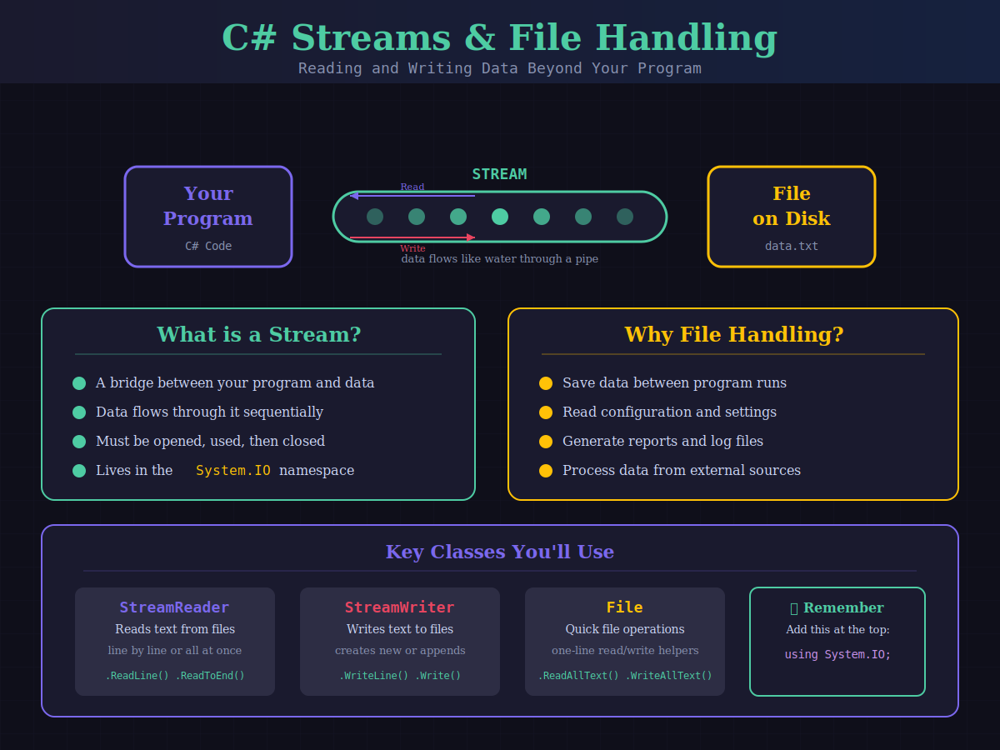
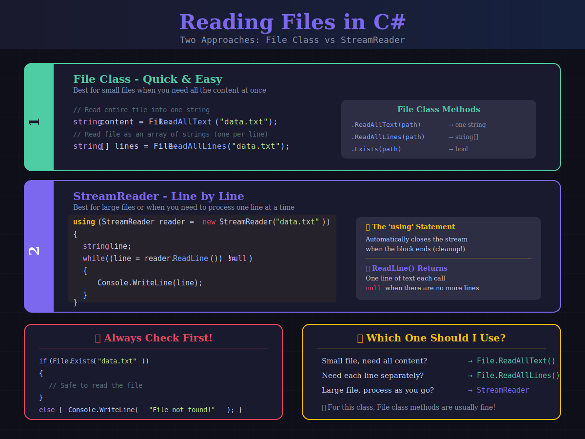
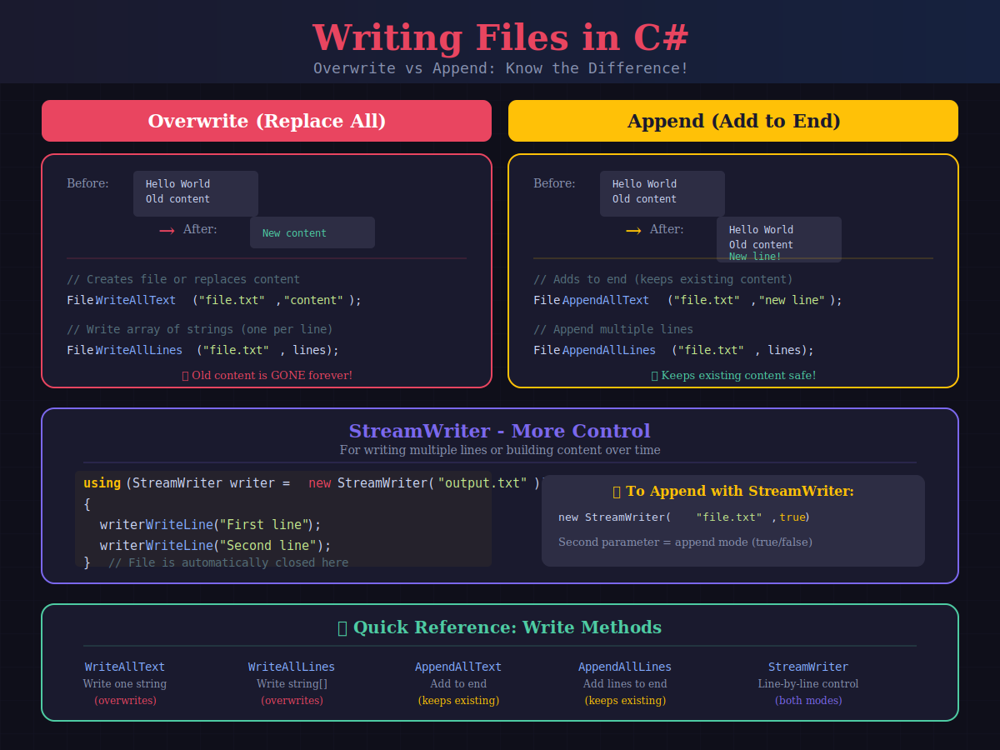
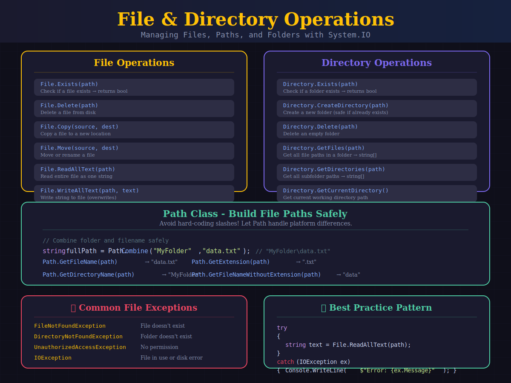

# 📚 C# Streams & File Handling
## Guided Notes - Follow along in Visual Studio or VS Code!

---

## Part 1: Introduction to Streams

### 🖼️ Streams Overview



---

## ▶ Demo 1: Writing to a File

### 💡 Why File Handling?
Variables only exist while your program is running. When the program ends, all data is lost! Files let you **save data permanently** so it's there next time you run your program.

```csharp
// ============================================
// DEMO 1: Writing Text to a File
// ============================================
using System.IO;

// Write a single string to a file (creates or overwrites)
File.WriteAllText("hello.txt", "Hello, World!\nWelcome to file handling!");

Console.WriteLine("File written successfully!");

// Write an array of strings (one per line)
string[] lines = { "Line 1: First entry", "Line 2: Second entry", "Line 3: Third entry" };
File.WriteAllLines("lines.txt", lines);

Console.WriteLine("Lines file written!");
```

**Output:**
```
File written successfully!
Lines file written!
```

**Files Created:**
```
hello.txt → Contains "Hello, World!" and "Welcome to file handling!"
lines.txt → Contains three lines of text
```

### 📝 Your Notes:
_Write key observations here..._

---

> ⚠️ **Important: Overwrite Warning**
> 
> `File.WriteAllText()` and `File.WriteAllLines()` will **replace** the entire file contents! If the file already exists, the old content is gone forever.

---

### ✏️ Try it Yourself #1

Write a program that creates two files:

1. A file called `about-me.txt` that contains your name and your favorite food on separate lines using `WriteAllText` (remember `\n` creates a new line)
2. A file called `top3.txt` that contains your top 3 favorite movies, one per line, using `WriteAllLines`

Print a confirmation message after each file is created.

```csharp
// ============================================
// TRY IT: Create your own files
// ============================================
using System.IO;

// 1. Write about-me.txt using WriteAllText


// 2. Write top3.txt using WriteAllLines

```

---

## ▶ Demo 2: Reading from a File

### 🖼️ Reading Files



```csharp
// ============================================
// DEMO 2: Reading Text from a File
// ============================================

// First, always check if the file exists!
if (File.Exists("hello.txt"))
{
    // Read entire file as one string
    string content = File.ReadAllText("hello.txt");
    Console.WriteLine("--- File Content ---");
    Console.WriteLine(content);
}
else
{
    Console.WriteLine("File not found!");
}

Console.WriteLine();

// Read file as an array of lines
if (File.Exists("lines.txt"))
{
    string[] lines = File.ReadAllLines("lines.txt");
    Console.WriteLine($"File has {lines.Length} lines:");
    
    for (int i = 0; i < lines.Length; i++)
    {
        Console.WriteLine($"  [{i}] {lines[i]}");
    }
}
```

**Output:**
```
--- File Content ---
Hello, World!
Welcome to file handling!

File has 3 lines:
  [0] Line 1: First entry
  [1] Line 2: Second entry
  [2] Line 3: Third entry
```

### Key Points:

| Method | Returns | Use When |
|--------|---------|----------|
| `File.ReadAllText(path)` | One `string` | You need the whole file at once |
| `File.ReadAllLines(path)` | `string[]` array | You need to process line by line |
| `File.Exists(path)` | `bool` | Always check before reading! |

---

### ✏️ Try it Yourself #2

Read back the files you created in Try it #1:

1. Read `about-me.txt` using `ReadAllText` and print the contents
2. Read `top3.txt` using `ReadAllLines` and print each movie with a number (e.g. `1. The Matrix`)
3. Try reading a file called `fake.txt` that doesn't exist — make sure you check with `File.Exists()` first!

```csharp
// ============================================
// TRY IT: Read your files back
// ============================================
using System.IO;

// 1. Read and display about-me.txt


// 2. Read top3.txt and print each movie numbered


// 3. Safely check for fake.txt

```

---

## Part 2: Appending & StreamWriter

### 🖼️ Writing Files



---

## ▶ Demo 3: Appending to Files

### 📎 Append = Add to the End
Unlike `WriteAllText` which replaces everything, **appending** adds new content to the end of the file while keeping what's already there.

```csharp
// ============================================
// DEMO 3: Appending vs Overwriting
// ============================================

// Start with a fresh file
File.WriteAllText("log.txt", "=== Application Log ===\n");
Console.WriteLine("Log file created.");

// Append entries (keeps existing content!)
File.AppendAllText("log.txt", "Entry 1: Application started\n");
File.AppendAllText("log.txt", "Entry 2: User logged in\n");
File.AppendAllText("log.txt", "Entry 3: Data saved\n");

Console.WriteLine("Entries appended.");

// Read and display the full file
string logContent = File.ReadAllText("log.txt");
Console.WriteLine("\n--- Full Log ---");
Console.WriteLine(logContent);
```

**Output:**
```
Log file created.
Entries appended.

--- Full Log ---
=== Application Log ===
Entry 1: Application started
Entry 2: User logged in
Entry 3: Data saved
```

---

### ✏️ Try it Yourself #3

Build a simple "guest book" file:

1. Use `WriteAllText` to create `guestbook.txt` with a header line: `"=== Guest Book ===\n"`
2. Use `AppendAllText` to add at least 3 guest entries (e.g. `"Alice was here!\n"`)
3. Read the file back with `ReadAllText` and print the full guest book

**Bonus:** After printing, use `WriteAllText` to overwrite the file with `"CLEARED"`. Read it again — what happened to the guest entries?

```csharp
// ============================================
// TRY IT: Build a guest book
// ============================================
using System.IO;

// 1. Create guestbook.txt with a header


// 2. Append guest entries


// 3. Read and print the full guest book


// BONUS: Overwrite and re-read — what happened?

```

---

## ▶ Demo 4: StreamReader & StreamWriter

### 💡 When to Use Streams
The `File` class methods are convenient, but for more control (especially with large files), use `StreamReader` and `StreamWriter`. The `using` statement ensures the stream is properly closed.

```csharp
// ============================================
// DEMO 4: StreamWriter and StreamReader
// ============================================

// Writing with StreamWriter
using (StreamWriter writer = new StreamWriter("students.txt"))
{
    writer.WriteLine("Name,Grade,GPA");
    writer.WriteLine("Alice,12,3.8");
    writer.WriteLine("Bob,11,3.5");
    writer.WriteLine("Charlie,12,3.9");
}
// File is automatically closed when 'using' block ends!

Console.WriteLine("Student file written with StreamWriter.");

// Reading with StreamReader
Console.WriteLine("\n--- Reading with StreamReader ---");
using (StreamReader reader = new StreamReader("students.txt"))
{
    string line;
    int lineNumber = 1;
    
    while ((line = reader.ReadLine()) != null)
    {
        Console.WriteLine($"  Line {lineNumber}: {line}");
        lineNumber++;
    }
}

Console.WriteLine("\nFile reading complete.");
```

**Output:**
```
Student file written with StreamWriter.

--- Reading with StreamReader ---
  Line 1: Name,Grade,GPA
  Line 2: Alice,12,3.8
  Line 3: Bob,11,3.5
  Line 4: Charlie,12,3.9

File reading complete.
```

> 🔒 **The `using` Statement**
>
> `using` automatically calls `.Close()` and `.Dispose()` on the stream when the block ends. This is the same `finally` cleanup concept from exception handling! Always use `using` with streams.

---

### ✏️ Try it Yourself #4

Create a mini recipe file using `StreamWriter`, then read it back with `StreamReader`:

1. Use a `StreamWriter` inside a `using` block to write a file called `recipe.txt` — include a title line, then at least 3 ingredient lines
2. Use a `StreamReader` inside a `using` block to read `recipe.txt` line by line and print each line with a line number

```csharp
// ============================================
// TRY IT: Write and read with streams
// ============================================
using System.IO;

// 1. Write recipe.txt with StreamWriter


// 2. Read recipe.txt with StreamReader

```

---

## Part 3: File & Directory Operations

### 🖼️ File Operations



---

## ▶ Demo 5: File Operations

```csharp
// ============================================
// DEMO 5: File and Path Operations
// ============================================

string fileName = "demo-file.txt";

// Create a file
File.WriteAllText(fileName, "This is a test file.");
Console.WriteLine($"Created: {fileName}");
Console.WriteLine($"File exists? {File.Exists(fileName)}");

// Get info using Path class
Console.WriteLine($"\nPath Info:");
Console.WriteLine($"  File name: {Path.GetFileName(fileName)}");
Console.WriteLine($"  Extension: {Path.GetExtension(fileName)}");
Console.WriteLine($"  Without ext: {Path.GetFileNameWithoutExtension(fileName)}");

// Build paths safely
string folder = "MyData";
string fullPath = Path.Combine(folder, "saved.txt");
Console.WriteLine($"\nCombined path: {fullPath}");

// Copy a file
File.Copy(fileName, "demo-copy.txt", true);  // true = overwrite if exists
Console.WriteLine($"\nCopied to: demo-copy.txt");

// Delete a file
if (File.Exists("demo-copy.txt"))
{
    File.Delete("demo-copy.txt");
    Console.WriteLine("Copy deleted.");
}
```

**Output:**
```
Created: demo-file.txt
File exists? True

Path Info:
  File name: demo-file.txt
  Extension: .txt
  Without ext: demo-file

Combined path: MyData\saved.txt

Copied to: demo-copy.txt
Copy deleted.
```

---

### ✏️ Try it Yourself #5

Practice file operations:

1. Create a file called `original.txt` with any content you want
2. Use `Path.GetExtension()` and `Path.GetFileNameWithoutExtension()` to print the file's extension and name separately
3. Copy `original.txt` to `backup.txt` using `File.Copy()`
4. Check that `backup.txt` exists with `File.Exists()` and print the result
5. Delete `backup.txt` with `File.Delete()` and confirm it's gone

```csharp
// ============================================
// TRY IT: File operation practice
// ============================================
using System.IO;

// 1. Create original.txt


// 2. Print path info


// 3. Copy to backup.txt


// 4. Verify backup exists


// 5. Delete backup and confirm

```

---

## ▶ Demo 6: Exception Handling with Files

### 🛡️ Protecting Your File Code
File operations are one of the most common places you'll need `try-catch`. Files might not exist, drives might be full, or permission might be denied.

```csharp
// ============================================
// DEMO 6: try-catch with File Operations
// ============================================

// Scenario 1: File doesn't exist
Console.WriteLine("--- Scenario 1: Missing File ---");
try
{
    string content = File.ReadAllText("nonexistent.txt");
    Console.WriteLine(content);
}
catch (FileNotFoundException)
{
    Console.WriteLine("❌ File was not found!");
}

// Scenario 2: Safe file reading pattern
Console.WriteLine("\n--- Scenario 2: Safe Reading ---");
string path = "safe-read.txt";
try
{
    if (File.Exists(path))
    {
        string text = File.ReadAllText(path);
        Console.WriteLine(text);
    }
    else
    {
        Console.WriteLine("File doesn't exist. Creating it...");
        File.WriteAllText(path, "Created by the program!");
        Console.WriteLine("✅ File created successfully.");
    }
}
catch (IOException ex)
{
    Console.WriteLine($"❌ IO Error: {ex.Message}");
}

Console.WriteLine("\n✓ Program continues...");
```

**Output:**
```
--- Scenario 1: Missing File ---
❌ File was not found!

--- Scenario 2: Safe Reading ---
File doesn't exist. Creating it...
✅ File created successfully.

✓ Program continues...
```

---

### ✏️ Try it Yourself #6

Practice safe file handling with `try-catch`:

1. Wrap a `File.ReadAllText("does-not-exist.txt")` call in a `try-catch` that catches `FileNotFoundException` and prints a friendly error message
2. Write a "safe read" block: try to read a file called `settings.txt` — if it doesn't exist, create it with a default value like `"volume=50"`, then read it back and print the contents. Wrap the whole thing in a `try-catch` for `IOException`.

```csharp
// ============================================
// TRY IT: Safe file handling
// ============================================
using System.IO;

// 1. try-catch for a missing file


// 2. Safe read — create if missing, then read

```

---

## ▶ Demo 7: Practical Example - Simple Data Storage

```csharp
// ============================================
// DEMO 7: Saving and Loading a List
// ============================================

List<string> names = new List<string> { "Alice", "Bob", "Charlie" };

// Save list to file
string savePath = "names.txt";
File.WriteAllLines(savePath, names);
Console.WriteLine($"Saved {names.Count} names to file.");

// Clear and reload from file
names.Clear();
Console.WriteLine($"List cleared. Count: {names.Count}");

// Load from file
if (File.Exists(savePath))
{
    string[] loaded = File.ReadAllLines(savePath);
    names.AddRange(loaded);
    Console.WriteLine($"Loaded {names.Count} names from file.");
    
    foreach (string name in names)
    {
        Console.WriteLine($"  - {name}");
    }
}
```

**Output:**
```
Saved 3 names to file.
List cleared. Count: 0
Loaded 3 names from file.
  - Alice
  - Bob
  - Charlie
```

---

### ✏️ Try it Yourself #7

Build a simple "high scores" save/load system:

1. Create a `List<string>` with at least 4 entries formatted like `"PlayerName - Score"` (e.g. `"Alice - 9500"`)
2. Save the list to `highscores.txt` using `File.WriteAllLines()`
3. Clear the list
4. Load the scores back from the file using `File.ReadAllLines()` and `AddRange()`
5. Print all the loaded scores with a numbered list

**Bonus:** After loading, add a new score to the list with `.Add()`, then re-save the updated list to the file.

```csharp
// ============================================
// TRY IT: High scores save/load
// ============================================
using System.IO;

// 1. Create the high scores list


// 2. Save to highscores.txt


// 3. Clear the list


// 4. Load from file


// 5. Print loaded scores


// BONUS: Add a new score and re-save

```

---

## 📝 Quick Summary - Fill in the blanks:

- `File.WriteAllText()` - **_______________** the file with new content
- `File.AppendAllText()` - **_______________** to the end of the file
- `File.ReadAllText()` - Returns file content as a **_______________**
- `File.ReadAllLines()` - Returns file content as a **_______________**
- `using` - Ensures the stream is **_______________** automatically

---

## 📋 Cheat Sheet

### Method Comparison

| Method | Action | Keeps Old Data? |
|--------|--------|-----------------|
| `File.WriteAllText()` | Write string | ❌ No (overwrites) |
| `File.WriteAllLines()` | Write string[] | ❌ No (overwrites) |
| `File.AppendAllText()` | Add string | ✅ Yes |
| `File.AppendAllLines()` | Add string[] | ✅ Yes |
| `File.ReadAllText()` | Read → string | N/A |
| `File.ReadAllLines()` | Read → string[] | N/A |

### Quick Reference - Copy these patterns!

```csharp
using System.IO;

// Write to file
File.WriteAllText("file.txt", "content");

// Read from file
string content = File.ReadAllText("file.txt");
string[] lines = File.ReadAllLines("file.txt");

// Append to file
File.AppendAllText("file.txt", "more content\n");

// Check if file exists
if (File.Exists("file.txt")) { /* safe to read */ }

// StreamWriter with using
using (StreamWriter writer = new StreamWriter("file.txt"))
{
    writer.WriteLine("line of text");
}

// StreamReader with using
using (StreamReader reader = new StreamReader("file.txt"))
{
    string line;
    while ((line = reader.ReadLine()) != null)
    {
        Console.WriteLine(line);
    }
}

// Path operations
string path = Path.Combine("folder", "file.txt");
```

---

## Common Exceptions Reference

| Exception | When It Occurs |
|-----------|----------------|
| `FileNotFoundException` | File doesn't exist at path |
| `DirectoryNotFoundException` | Folder in path doesn't exist |
| `UnauthorizedAccessException` | No permission to read/write |
| `IOException` | General I/O error (file in use, disk full) |

---

*End of Guided Notes*
